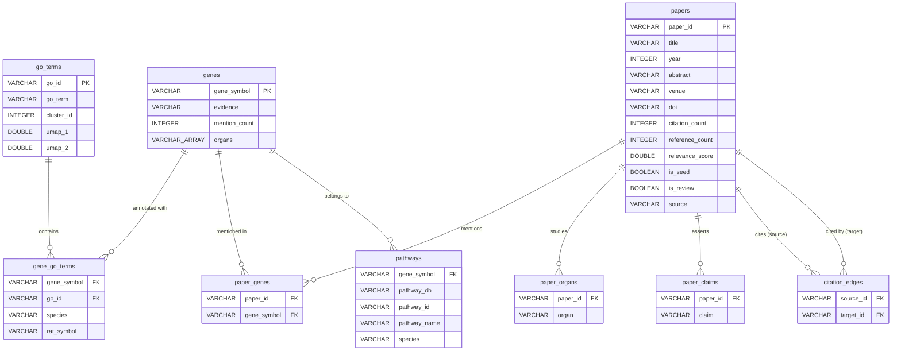

# Citation-Graph-Driven Toxicogenomics Gene Discovery

Identify hallmark genes for organ-specific toxicity in rat, relevant to human health, by mining the scientific literature at scale and cross-referencing with Gene Ontology biological process annotations.

## Table of Contents

- [Motivation](#motivation)
- [Phase 1: Citation Graph Construction](#phase-1-citation-graph-construction)
- [Phase 2: LLM-Based Claim and Gene Extraction](#phase-2-llm-based-claim-and-gene-extraction)
- [Phase 3: Gene Name Normalization](#phase-3-gene-name-normalization)
- [Phase 4: Consensus Classification](#phase-4-consensus-classification)
- [Phase 5: GO Term Cross-Reference](#phase-5-go-term-cross-reference)
- [Phase 6: Organ-Specific Crawls](#phase-6-organ-specific-crawls)
- [Phase 7: Gene-Function Crawl](#phase-7-gene-function-crawl)
- [Phase 8: Pathway Enrichment](#phase-8-pathway-enrichment)
- [Phase 9: Hybrid Scoring](#phase-9-hybrid-scoring)
- [Phase 10: Merged Consensus](#phase-10-merged-consensus)
- [Phase 11: Analytical Database](#phase-11-analytical-database)
- [Outputs](#outputs)
- [Usage](#usage)
- [Limitations](#limitations)

---

## Motivation

The architecture of this pipeline was inspired by **Recursive Language Models** (Zhang, Kraska & Khattab, 2026; [arXiv:2512.24601](https://arxiv.org/abs/2512.24601)). RLMs address the fundamental problem that LLMs degrade on long inputs: instead of feeding an entire corpus into context, the model holds data as variables in a REPL and writes code to decompose, filter, and recursively query itself on manageable pieces. On BrowseComp-Plus (6-11M token multi-hop QA), RLM achieved 91.3% accuracy where the base model scored 0%.

This pattern -- *give the agent a handle to a large dataset, let it programmatically decompose and recursively query itself* -- maps directly onto literature analysis. Rather than stuffing thousands of papers into context, our pipeline:

1. **Programmatic decomposition**: The citation graph crawler (`citegraph.py`) traverses the Semantic Scholar API graph structure, selecting papers via relevance scoring and governor heuristics -- the equivalent of RLM's code-based chunking and filtering.
2. **Recursive per-chunk extraction**: A local LLM (Qwen 2.5 14B) processes each paper's abstract individually (`extract.py`), extracting structured claims, genes, and organs -- the equivalent of RLM's `llm_query()` calls on individual chunks.
3. **Programmatic accumulation**: Results are accumulated across 2,315 papers through normalization, deduplication, and consensus classification -- the equivalent of RLM's REPL variable accumulation and final synthesis.
4. **Cross-reference enrichment**: The accumulated gene set is enriched against external databases (GO, KEGG, Reactome) and unified into a queryable analytical database -- extending beyond what any single-context LLM call could achieve.

The key insight from RLMs applied here: the bottleneck in literature analysis is not the LLM's reasoning ability but its context window. By decomposing the problem into graph traversal (code) and per-paper extraction (LLM), the pipeline scales to corpus sizes that would be impossible in a single prompt.

## Phase 1: Citation Graph Construction

**Approach.** Rather than manually curating papers, we built a citation graph outward from seed papers using the Semantic Scholar API, governed by relevance-scoring heuristics that control expansion.

**Seed selection.** 7 papers were selected by DOI as anchors spanning the field:
- Meier et al. 2024 -- *Progress in toxicogenomics to protect human health* (Nature Reviews Genetics, comprehensive review, 193 references)
- TXG-MAP (2017) and TXG-MAPr (2021) -- liver co-expression module frameworks
- Open TG-GATEs (2014) -- the foundational toxicogenomics database
- TransTox (2024) -- multi-organ transcriptomic translation (liver <-> kidney)
- Reconciled rat-human metabolic networks (2017)
- MSigDB Hallmark Gene Sets (2015)

An additional 5 seed papers were added via keyword search targeting underrepresented organs (kidney, heart).

**Graph expansion.** From each seed, we fetched its references and citing papers from Semantic Scholar, then expanded outward to depth 2. Each candidate paper was scored for relevance before inclusion.

**Governor system.** Five stopping criteria controlled the crawl to prevent runaway expansion:

1. **Relevance threshold (0.3).** Each paper was scored 0.0-1.0 against 25 topic keywords (toxicogenomics, gene expression, transcriptomics, organ names, biomarker, etc.). Title matches were weighted 3x over abstract matches. Papers below 0.3 were discarded. Of ~3,000 papers considered, **2,208 were rejected** by this filter.

2. **Max depth (2).** No paper more than 2 citation hops from a seed was included, preventing drift into tangential fields.

3. **Max papers (800).** Hard budget cap. The crawl exhausted its queue at 798 papers before hitting this limit, indicating natural saturation of the relevance-filtered graph.

4. **Saturation detection.** A sliding window tracked the novelty of incoming papers by measuring new bigram concepts. If the last 20 papers contributed fewer than 5% new concepts, the crawl would stop. This did not trigger -- the relevance filter was strict enough to maintain novelty.

5. **API budget (500 calls).** Hard cap on Semantic Scholar API requests. The crawl used 293.

**Result.** 798 papers, 999 citation edges, 326 reviews. Organ distribution: liver (60 papers at depth 0), kidney (40), heart (24), brain (20), lung (4), intestine (4), plus minor representation of adrenal, spleen, testis. The primary focus on liver and kidney reflects the seed selection; other organs were incidental catches via citation chains.

## Phase 2: LLM-Based Claim and Gene Extraction

**Approach.** Each paper's abstract was processed by a local LLM (Qwen 2.5 14B, Q4_K_M quantization) to extract structured information: gene names, organs studied, methods used, scientific claims, and a stance classification.

**Infrastructure.** Two GPUs ran in parallel:
- RTX 3080 Ti (12GB, local) -- qwen2.5:14b via Ollama
- RX 6900 XT (16GB, remote via SSH tunnel) -- qwen2.5:14b via Ollama

Papers were distributed round-robin across endpoints. No cloud LLM tokens were consumed.

**Extraction prompt.** The LLM was instructed to return a JSON object with fields for claims, genes (as standard symbols), organs, methods, species, a stance classification (supports_consensus / challenges_consensus / neutral / novel_finding), and a confidence score. A JSON parser with fallback heuristics handled formatting variations.

**Result.** 650 of 798 papers had abstracts available for extraction (148 lacked abstracts in Semantic Scholar). 172 papers yielded explicit gene names. This is expected -- most papers discuss genes in full text, not abstracts.

## Phase 3: Gene Name Normalization

**Problem.** The same gene appears under different names across papers: P53 vs TP53, BCL-2 vs BCL2, TNF-alpha vs TNFA vs TNF, NRF2 vs NFE2L2, Caspase-3 vs CASP3, KIM-1 vs HAVCR1.

**Approach.** A curated alias table of ~100 mappings was built covering:
- Common name <-> HGNC symbol (NRF2 -> NFE2L2, KIM-1 -> HAVCR1)
- Punctuation/casing variants (BCL-2 -> BCL2, TNF-alpha -> TNF)
- Protein names -> gene symbols (Caspase-3 -> CASP3)
- Greek letter variants (PPARalpha -> PPARA, IL-1beta -> IL1B)

Organ names were similarly normalized (hippocampus/cerebellum/cortex -> brain, hepatocytes -> liver, etc.).

**Impact.** Normalization consolidated 461 raw gene names into 432 unique genes and significantly boosted consensus counts:
- TP53: 8 -> 14 papers (merged P53 + TP53)
- BCL2: 4 -> 11 papers (merged BCL-2 + BCL2)
- TNF: 4 -> 8 papers (merged TNF-alpha + TNFA + TNF)
- HAVCR1: 0 -> 4 papers (merged KIM-1 + KIM1)

## Phase 4: Consensus Classification

**Heuristic.** Genes were classified by the number of independent papers mentioning them:

- **Consensus (3+ papers):** 35 genes. These are established hallmark genes with cross-study validation. The top tier: NFE2L2 (27 papers), TP53 (14), BAX (12), PPARA (12), BCL2 (11), TNF (8), NFKB1 (7), CASP3 (7), IL6 (7).

- **Moderate evidence (2 papers):** 34 genes. Corroborated by at least one independent study. Includes CLU, CCNG1, EGR1, FGF21, KIM-1/HAVCR1, DRP1, GPX4.

- **Single mention (1 paper):** 363 genes. These include both well-known genes that happened to appear in only one abstract (undersampling artifact) and genuinely novel candidates from recent papers. Notably, several clusters of single-mention genes came from recent (2025-2026) single-cell sequencing and ML-based network studies, representing frontier candidates not yet validated by independent work.

**Organ-specific patterns.** The consensus genes partition into:
- Universal stress response: NFE2L2, BAX, TP53, BCL2 (appear across nearly all organs)
- Liver-specific: PPARA, AHR, CAR, CYP1A1, CYP7A1, GCLC, HSP90AA1
- Kidney-emerging: HAVCR1 (KIM-1), CLU, CD44, MDM2
- Heart: MFN2, SIRT1, IL1B, AMPK, TTN, DRP1 (mitochondrial dynamics)
- Cross-organ inflammation: TNF, NFKB1, IL6, IL1B

## Phase 5: GO Term Cross-Reference

**Approach.** 2,840 Gene Ontology Biological Process terms (from BMDExpress reference UMAP data, with cluster assignments) were cross-referenced with gene annotations from two sources:

1. **Rat GO annotations** (EBI GOA, goa_rat.gaf) -- 12,363 GO terms, 564K annotations
2. **Human GO annotations** (EBI GOA, goa_human.gaf) -- 11,207 GO terms, 834K annotations

An outer join was performed: every GO term appears in the output regardless of whether gene annotations exist. Each gene row is tagged with species provenance:
- `rat` -- annotated only in rat GAF
- `human` -- annotated only in human GAF
- `rat | human` -- annotated in both (conserved ortholog with shared function)

For `rat` and `rat | human` rows, the original rat gene symbol is preserved in a separate column alongside the HGNC display symbol.

Each gene was then cross-referenced against the toxicogenomics consensus analysis, adding evidence level, paper count, and implicated organs.

**Result.** 130,699 rows covering all 2,840 GO terms. 2,391 terms had gene annotations (449 had none in either species). 6,074 rows matched a toxicogenomics gene, spanning 1,318 distinct GO biological processes. Of these, 1,629 rows matched consensus-level genes, 739 matched moderate-evidence genes, and 3,706 matched single-mention genes.

## Phase 6: Organ-Specific Crawls

**Problem.** The general crawl (Phase 1) was seeded with liver/kidney-focused papers, leaving heart, brain, and lung underrepresented.

**Approach.** Three dedicated organ crawls were run, each with its own seed papers, search queries, and organ-boost keywords that gave +0.15 relevance to papers matching organ-specific vocabulary:

- **Heart** (400 papers): 6 DOI seeds (cardiotoxicity reviews, anthracycline signatures, TG-GATEs) + 5 keyword searches. Boost keywords: cardiac, cardiotoxic, doxorubicin, troponin, myocardial, etc.
- **Brain** (400 papers): 5 DOI seeds (neurotoxicity transcriptomics, organophosphate ML study) + 5 keyword searches. Boost keywords: neurotoxic, hippocampal, dopaminergic, astrocyte, etc.
- **Lung** (400 papers): 5 DOI seeds (nanomaterial meta-analysis, MWCNT inhalation) + 5 keyword searches. Boost keywords: pulmonary, inhalation, alveolar, nanoparticle, etc.

**Result.** 1,200 additional papers across the three organs, with 924 unique after deduplication against the general crawl.

## Phase 7: Gene-Function Crawl

**Problem.** The toxicogenomics crawls (Phases 1 and 6) only retained papers matching tox vocabulary. This missed gene-function papers -- papers that explain WHY a gene matters for organ-specific biology but don't use tox terminology (e.g., "MFN2 regulates mitochondrial fusion in cardiomyocytes").

**Approach.** A second-pass crawl (`genefunc_crawl.py`) searched Semantic Scholar for each consensus/moderate gene's biological function in its associated organs. Key differences from the main crawl:

- **Search queries** were gene-centric: e.g., "NFE2L2 liver function mechanism", "MFN2 cardiomyocyte role biological"
- **Relevance scoring** required gene name in title/abstract + organ keyword mention, with no toxicogenomics vocabulary requirement
- **1-hop expansion** from top search results to catch related function papers

Two passes were run:
- Pass 1: covered 14 genes (NFE2L2, TP53, BAX, BCL2, etc.) before hitting 200 API call budget, yielding 246 papers
- Pass 2: covered 16 additional genes (KEAP1, GDF15, SQSTM1, SOD1, BTG2, etc.) with a 500 API call budget, yielding 400 papers

**Result.** 646 gene-function papers across 30 genes, covering brain (124), liver (155), heart (104), kidney (105) -- substantially expanding the evidence base for genes that were previously marginal.

## Phase 8: Pathway Enrichment

**Approach.** The 69 consensus + moderate genes were cross-referenced against two pathway databases (`pathway_enrich.py`):

1. **KEGG** (REST API, bulk download): All human (`hsa`) and rat (`rno`) gene-pathway links were downloaded. Gene IDs were mapped to symbols via `rest.kegg.jp/list/{species}`. 8,720 human and 10,032 rat genes matched, yielding pathway annotations for our genes.

2. **Reactome** (REST API, per-gene query): Each gene was queried against Homo sapiens pathways. 69/69 genes returned at least one pathway hit.

**Result.** `pathway_enrichment.tsv` with 2,860 rows of gene-pathway associations, covering KEGG (human + rat, deduplicated by pathway name) and Reactome pathways for all 69 genes.

## Phase 9: Hybrid Scoring

**Approach.** To ensure future crawls automatically retain gene-function papers, a gene-aware relevance floor was added to `citegraph.py`:

- A `known_genes` set can be loaded from the consensus JSON (68 genes with symbols >= 3 chars)
- In `score_relevance()`: after normal keyword scoring, if a paper mentions any known gene (case-sensitive word-boundary regex) AND any organ keyword, the score is raised to at least 0.35
- This ensures gene-function papers pass the relevance threshold even without tox vocabulary

## Phase 10: Merged Consensus

**Approach.** All 7 extraction files were merged (`extract.py merge`), deduplicating by paper ID:

| Source | Total | Unique (after dedup) |
|--------|-------|---------------------|
| `citegraph_output/` (initial) | 50 | 50 |
| `citegraph_output_800/` (expanded) | 798 | 750 |
| `citegraph_output_brain/` | 400 | 271 |
| `citegraph_output_genefunc/` (pass 1) | 246 | 246 |
| `citegraph_output_genefunc2/` (pass 2) | 400 | 345 |
| `citegraph_output_heart/` | 400 | 310 |
| `citegraph_output_lung/` | 400 | 343 |
| **Total** | **2,694** | **2,315** |

**Result.** The merged consensus significantly expanded gene coverage:

- **161 consensus genes** (3+ papers) -- up from 35 in Phase 4
- **149 moderate evidence genes** (2 papers) -- up from 34
- **1,377 total unique genes** -- up from 432

Top genes by paper count: NFE2L2 (81), TP53 (63), BCL2 (45), BAX (41), SIRT1 (39), IL6 (38), KEAP1 (37), TNF (36), HMOX1 (32), CASP3 (30).

New consensus genes promoted from moderate/single: MFN2 (24 papers), GDF15 (20), SQSTM1 (12), BDNF (12), SOD1 (13), PPARGC1A (13), PIK3CA (12).

## Phase 11: Analytical Database

All crawl outputs, extractions, GO annotations, and pathway enrichment data are unified into a single DuckDB database (`bmdx.duckdb`) for fast analytical queries. The schema normalizes the scattered JSON/TSV files into 9 interlinked tables.

### Schema



### Tables

| Table | Rows | Description |
|-------|------|-------------|
| `go_terms` | 2,840 | GO Biological Process terms with UMAP coordinates and HDBSCAN clusters (from BMDExpress reference data) |
| `genes` | 21,490 | Union of all gene symbols -- 161 consensus, 149 moderate, 1,067 single-mention, ~20k from GO annotations |
| `papers` | 2,319 | Deduplicated papers from all 7 crawl directories |
| `gene_go_terms` | 130,250 | Gene-to-GO-term annotations (rat, human, or both) |
| `paper_genes` | 2,769 | Which genes each paper mentions (normalized) |
| `paper_organs` | 2,326 | Which organs each paper studies (normalized) |
| `paper_claims` | 4,431 | Scientific claims extracted from abstracts |
| `citation_edges` | 2,224 | Paper-cites-paper edges from all crawl graphs |
| `pathways` | 2,860 | Gene-pathway associations (KEGG + Reactome) |

### Data sources

| Source file | Tables fed |
|-------------|------------|
| `referenceUmapData.ts` (BMDExpress) | `go_terms` |
| `go_term_genes.tsv` | `gene_go_terms`, `genes` (supplement) |
| `citegraph_output/gene_consensus_merged.json` | `genes` |
| `citegraph_output/gene_consensus_merged_extractions.json` | `paper_genes`, `paper_organs`, `paper_claims` |
| `citegraph_output*/papers.json` (x7) | `papers` |
| `citegraph_output*/edges.json` (x7) | `citation_edges` |
| `pathway_enrichment.tsv` | `pathways` |

### Example queries

```sql
-- Consensus genes in UMAP cluster 5 with their KEGG pathways
SELECT g.gene_symbol, gt.go_term, p.pathway_id
FROM genes g
JOIN gene_go_terms ggt ON g.gene_symbol = ggt.gene_symbol
JOIN go_terms gt ON ggt.go_id = gt.go_id
JOIN pathways p ON g.gene_symbol = p.gene_symbol
WHERE g.evidence = 'consensus'
  AND gt.cluster_id = 5
  AND p.pathway_db = 'kegg';

-- Papers mentioning a gene, with their claims
SELECT p.title, p.year, pc.claim
FROM paper_genes pg
JOIN papers p ON pg.paper_id = p.paper_id
LEFT JOIN paper_claims pc ON pg.paper_id = pc.paper_id
WHERE pg.gene_symbol = 'TP53';

-- Consensus genes that appear in heart papers
SELECT DISTINCT g.gene_symbol, g.mention_count
FROM genes g
JOIN paper_genes pg ON g.gene_symbol = pg.gene_symbol
JOIN paper_organs po ON pg.paper_id = po.paper_id
WHERE g.evidence = 'consensus' AND po.organ = 'heart'
ORDER BY g.mention_count DESC;

-- Gene evidence breakdown
SELECT evidence, COUNT(*) FROM genes GROUP BY evidence ORDER BY COUNT(*) DESC;
```

## Outputs

| File | Contents |
|------|----------|
| `bmdx.duckdb` | Analytical database (9 tables, 9.8 MB) -- see [Phase 11](#phase-11-analytical-database) |
| `citegraph_output_800/papers.json` | 798 papers with metadata, relevance scores, organ tags |
| `citegraph_output_800/extractions.json` | 798 LLM extractions (claims, genes, organs, methods) |
| `citegraph_output_brain/papers.json` | 400 brain-focused papers |
| `citegraph_output_heart/papers.json` | 400 heart-focused papers |
| `citegraph_output_lung/papers.json` | 400 lung-focused papers |
| `citegraph_output_genefunc/papers.json` | 246 gene-function papers (pass 1, 14 genes) |
| `citegraph_output_genefunc2/papers.json` | 400 gene-function papers (pass 2, 16 genes) |
| `citegraph_output/gene_consensus.json` | Original 432 genes (Phases 1-4 only) |
| `citegraph_output/gene_consensus_merged.json` | 1,377 genes from all 7 sources merged |
| `pathway_enrichment.tsv` | 2,860 gene-pathway annotations (KEGG + Reactome) |
| `go_term_genes.tsv` | 130,699 rows: GO terms x genes x species x tox evidence |

## Usage

```bash
uv sync                                          # install dependencies
uv run python build_db.py                        # build bmdx.duckdb
uv run python build_db.py --output foo.duckdb    # custom output path
```

| Script | Purpose |
|--------|---------|
| `citegraph.py` | Citation graph crawler (Semantic Scholar API) |
| `extract.py` | LLM-based claim/gene extraction from abstracts |
| `go_gene_map.py` | GO term-gene cross-reference with rat/human GAF files |
| `genefunc_crawl.py` | Gene-function paper crawler |
| `pathway_enrich.py` | KEGG + Reactome pathway enrichment |
| `build_db.py` | Build the DuckDB analytical database |

Dependencies: Python >= 3.12, `duckdb`, `networkx`, `requests`.

## Limitations

1. **Abstract-only extraction.** Gene names were extracted from abstracts, not full text. This undersamples genes discussed only in results/methods sections.

2. **Gene-function crawl coverage.** The gene-function crawl covered 30 of 69 target genes before exhausting its API budget. The remaining 39 genes (mostly moderate-evidence with fewer papers) were not searched for function papers. Rate limiting by the Semantic Scholar API (no API key) was the primary bottleneck.

3. **Keyword-based relevance scoring.** The governor's relevance filter uses keyword matching, not semantic understanding. The hybrid scoring (Phase 9) partially addresses this for known genes but does not help with novel gene discovery.

4. **Gene name normalization coverage.** The alias table covers ~100 common variants but is not exhaustive. Uncommon aliases or very recent gene name changes may be missed.

5. **Pathway enrichment is database-only.** The KEGG/Reactome annotations reflect curated database knowledge, not our literature evidence. Combining pathway membership with paper-derived evidence would yield stronger functional groupings.

6. **No full-text or database validation.** The gene lists have not been cross-validated against curated databases (CTD, TXG-MAPr modules) or full-text extraction. This would strengthen the consensus classification significantly.
